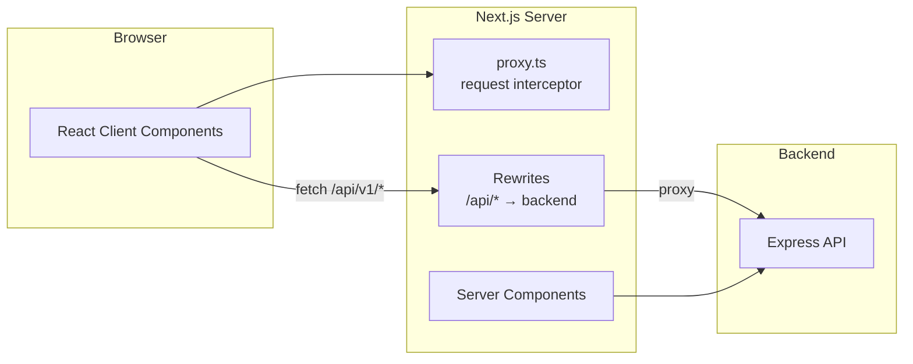

# Dhaka Tesla Pool — Frontend

The Next.js frontend for **Dhaka Tesla Pool**. Provides the passenger and driver UI on top of a REST backend.

This document covers architecture, routing, components, state management, API integration, testing, and deployment.

> **"MVP" throughout this project means Minimum Viable Product.**

---

## Table of Contents

1. [Overview](#1-overview)
2. [Quick Start](#2-quick-start)
3. [Tech Stack](#3-tech-stack)
4. [Project Structure](#4-project-structure)
5. [Architecture](#5-architecture)
6. [Routing & Pages](#6-routing--pages)
7. [Components](#7-components)
8. [Auth Flow](#8-auth-flow)
9. [API Client](#9-api-client)
10. [Proxy & Rewrites](#10-proxy--rewrites)
11. [State Management](#11-state-management)
12. [Styling](#12-styling)
13. [Testing](#13-testing)
14. [Environment Variables](#14-environment-variables)
15. [Deployment](#15-deployment)
16. [Known Limitations](#16-known-limitations)
17. [Next Improvements](#17-next-improvements)

---

## 1. Overview

### What This App Does

The frontend is a thin client over the backend REST API. It:

- Renders the passenger and driver UI
- Manages auth state via httpOnly cookies
- Displays fares, distances, and statuses computed by the backend
- Polls the backend for live status updates
- Never computes a fare or a distance

### Two User Roles

| Role | Pages | Primary actions |
|------|-------|-----------------|
| **PASSENGER** | `/passenger/*` | Request rides, track status, view history, cancel |
| **DRIVER** | `/driver/*` | Go online, accept requests, manage pool lifecycle, view history |

### The Cast

Same as the backend: Jashim (driver), Nusrat, Rafiq, Shirin (passengers), Bullet (Tesla).

---

## 2. Quick Start

```bash
# 1. Install
cd dhaka-tesla-pool/frontend
bun install

# 2. Configure environment
cp ../.env.example .env.local
# Edit .env.local:
#   BACKEND_URL=http://localhost:5000
#   NEXT_PUBLIC_API_URL=

# 3. Start dev server (backend must also be running)
bun run dev
# Frontend on http://localhost:3000
```

Open http://localhost:3000.

### Demo Login

Click the **tap-to-fill** panel on the login page to autofill any seeded user. Password for all: `password123`.

---

## 3. Tech Stack

| Layer | Choice | Why |
|-------|--------|-----|
| Framework | **Next.js 16** (App Router) | Built-in routing, SSR, easy Vercel deploy |
| Language | **TypeScript** | Type safety shared with the backend shape |
| Styling | **Tailwind CSS** | Utility-first, no naming overhead |
| State | **React Context** | Small app; no Redux/Zustand needed |
| API calls | **fetch** wrapped in a typed client | No axios needed |
| Tests | **Playwright** | Real browser, full flows |

---

## 4. Project Structure

```
frontend/
├── app/
│   ├── layout.tsx                 # Root layout + AuthProvider + Header
│   ├── page.tsx                   # Landing page
│   ├── globals.css
│   ├── login/page.tsx
│   ├── signup/page.tsx
│   ├── passenger/
│   │   ├── rides/
│   │   │   ├── page.tsx           # My rides list
│   │   │   ├── new/page.tsx       # Request a ride
│   │   │   └── [id]/page.tsx      # Ride detail with polling
│   └── driver/
│       ├── page.tsx               # Dashboard
│       ├── requests/page.tsx      # Accept requests
│       └── history/page.tsx
├── components/
│   ├── Header.tsx                 # Role-aware nav
│   ├── RequireAuth.tsx            # Client-side guard
│   ├── ZoneSelect.tsx             # Dropdown for zones
│   ├── StatusBadge.tsx
│   ├── StatusTimeline.tsx
│   ├── PoolLifecycleCard.tsx      # Driver's active trip card
│   ├── DriverRequestRow.tsx
│   ├── PassengerProfileModal.tsx
│   ├── PassengerNameButton.tsx
│   ├── OnlineToggle.tsx
│   ├── Spinner.tsx
│   ├── ErrorBox.tsx
│   └── EmptyState.tsx
├── lib/
│   ├── api.ts                     # Typed fetch client
│   ├── auth-context.tsx           # AuthProvider + useAuth
│   ├── types.ts                   # Shared types
│   ├── format.ts                  # poysha→taka, meters→km
│   └── redirect.ts
├── e2e/                           # Playwright specs
│   ├── helpers/
│   ├── auth.spec.ts
│   ├── passenger.spec.ts
│   └── pooling.spec.ts
├── public/
├── proxy.ts                       # Next.js 16 request interceptor
├── next.config.ts                 # Rewrites to backend
├── playwright.config.ts
├── tailwind.config.ts
├── tsconfig.json
├── package.json
└── .env.local
```

---

## 5. Architecture



**Key idea:** the browser only ever talks to `localhost:3000` (dev) or the Vercel URL (prod). Next.js silently proxies `/api/*` to the backend. This keeps cookies first-party, which is required for auth to work reliably in modern browsers.

---

## 6. Routing & Pages

### Public

| Route | Purpose |
|-------|---------|
| `/` | Landing page with role-aware CTAs |
| `/login` | Login form with demo shortcuts |
| `/signup` | Signup form with role selection |

### Passenger (`RequireAuth role="PASSENGER"`)

| Route | Purpose |
|-------|---------|
| `/passenger/rides/new` | Request form with live fare preview |
| `/passenger/rides` | Ride history table |
| `/passenger/rides/[id]` | Ride detail with 5s polling + cancel |

### Driver (`RequireAuth role="DRIVER"`)

| Route | Purpose |
|-------|---------|
| `/driver` | Dashboard with online toggle + active pool card |
| `/driver/requests` | Open requests matching the driver's corridor |
| `/driver/history` | Completed pools with fare totals |

### Route Protection — Two Layers

1. **Server-side (`proxy.ts`)** — redirects unauthenticated users before the page renders. No flash of unauthenticated content.
2. **Client-side (`RequireAuth`)** — defense in depth. Re-verifies auth on mount; redirects on role mismatch.

Both run; the proxy catches 99% of cases, `RequireAuth` is the safety net.

---

## 7. Components

### Shared

| Component | Purpose |
|-----------|---------|
| `Header` | Role-aware nav bar with logout |
| `RequireAuth` | Client-side guard with optional role check |
| `Spinner` | Loading indicator |
| `ErrorBox` | Red inline error message |
| `EmptyState` | "Nothing here yet" placeholder |
| `StatusBadge` | Colored status pill |
| `StatusTimeline` | Vertical timeline of transitions |

### Passenger

| Component | Purpose |
|-----------|---------|
| `ZoneSelect` | Dropdown for pickup/destination |

### Driver

| Component | Purpose |
|-----------|---------|
| `OnlineToggle` | Toggle driver online/offline |
| `PoolLifecycleCard` | Active pool with live fare projection + lifecycle buttons |
| `DriverRequestRow` | Single request row with accept button |
| `PassengerProfileModal` | Modal showing passenger details |
| `PassengerNameButton` | Clickable name that opens the modal |

### Patterns

- **Presentational vs. container.** Presentational components (`StatusBadge`, `Spinner`) are pure; containers (`PoolLifecycleCard`, `DriverRequestRow`) fetch and manage state.
- **`'use client'` for interactive components.** Everything under `components/` is a client component.
- **Test IDs on interactive elements** (`data-testid`) so E2E specs are stable.

---

## 8. Auth Flow

### State — `AuthProvider`

```tsx
{
  user: AuthUser | null,      // Current user
  loading: boolean,            // True during initial /me fetch
  error: string | null,
  login: (email, password) => Promise<AuthUser>,
  signup: (data) => Promise<AuthUser>,
  logout: () => Promise<void>,
  refresh: () => Promise<void>,
}
```

### On Mount

```tsx
useEffect(() => {
  refresh();      // GET /api/v1/auth/me
}, [refresh]);
```

If the cookie is valid, `user` is set. If not, a 401 arrives, `user` stays `null`, `loading` becomes `false`. The header renders accordingly.

### Login Flow

1. User submits email/password on `/login`
2. `AuthProvider.login()` calls `POST /api/v1/auth/login`
3. Backend responds with `Set-Cookie: access_token=...` and user object
4. `setUser(user)` — the header updates immediately
5. `router.replace(homeForRole(user.role))` — redirect to the correct home

### Logout Flow

1. User clicks Logout in Header
2. `AuthProvider.logout()` calls `POST /api/v1/auth/logout`
3. Backend clears the cookie
4. `setUser(null)`
5. `router.push('/login')` and `router.refresh()`
6. `proxy.ts` sees no cookie on the next navigation and redirects any protected route to `/login`

### Cookie Handling

The cookie is **httpOnly** — JavaScript cannot read it. The browser sends it automatically with every request because `api.ts` uses `credentials: 'include'`. There's no token in localStorage or in memory.

---

## 9. API Client

`lib/api.ts` is a thin typed wrapper around `fetch`.

### Features

- **Credentials** — `credentials: 'include'` sends cookies
- **Timeout** — 10s `AbortController` per request
- **Typed errors** — throws `ApiClientError` with `status`, `code`, `message`, `details`
- **Automatic JSON parsing**

### Usage

```ts
import { api, ApiClientError } from '@/lib/api';

try {
  const res = await api.get<{ user: AuthUser }>('/api/v1/auth/me');
  console.log(res.user);
} catch (err) {
  if (err instanceof ApiClientError && err.status === 401) {
    // Not logged in
  }
}
```

### Why Relative URLs

`API_URL` is `process.env.NEXT_PUBLIC_API_URL ?? ''` — an empty string in deployment. This makes every call a **relative path** like `/api/v1/auth/me`. Next.js rewrites it to the real backend.

**Benefit:** cookies are same-origin. No `SameSite=None`. No CORS. Works in every browser.

---

## 10. Proxy & Rewrites

Two files work together.

### `next.config.ts`

```ts
const nextConfig: NextConfig = {
  async rewrites() {
    const backend = process.env.BACKEND_URL ?? 'http://localhost:5000';
    return [
      { source: '/api/:path*', destination: `${backend}/api/:path*` },
      { source: '/test/:path*', destination: `${backend}/test/:path*` },
    ];
  },
};
```

Runs on the Next.js server. Silently forwards `/api/v1/*` to the backend.

### `proxy.ts`

Intercepts requests **before** they hit a page.

```ts
export function proxy(request: NextRequest) {
  // 1. Read cookie
  // 2. Decode JWT (base64 only — no verify, that's the backend's job)
  // 3. Redirect logged-in users away from /login, /signup
  // 4. Redirect logged-out users away from /passenger/*, /driver/*
  // 5. Redirect role mismatches (passenger visiting /driver)
  return NextResponse.next();
}

export const config = {
  matcher: [
    '/passenger/:path*',
    '/driver/:path*',
    '/login',
    '/signup',
  ],
};
```

**Note:** In Next.js 16, the file is called `proxy.ts` and the exported function must be named `proxy` (was `middleware` in earlier versions).

**What the proxy does not do:** verify JWT signatures. It only decodes the payload to read the role. Verification is the backend's job.

---

## 11. State Management

No global store. Three kinds of state:

| Kind | Where | Example |
|------|-------|---------|
| **Auth** | React Context | Current user |
| **Server data** | Local `useState` + polling | Ride list, active pool |
| **UI state** | Local `useState` | Form inputs, modals open/closed |

### Polling Pattern

Rides in progress update live. Implemented with `setInterval` in a `useEffect`:

```tsx
useEffect(() => {
  if (!ride) return;
  if (!ACTIVE_STATUSES.includes(ride.status)) return;
  const interval = setInterval(fetchAll, 5000);
  return () => clearInterval(interval);
}, [ride, fetchAll]);
```

**Poll interval:** 5 seconds. **Stops automatically** when status is `COMPLETED` or `CANCELLED`.

Pages that poll:
- `/passenger/rides/[id]`
- `/driver` (dashboard)
- `/driver/requests`

### Why Polling, Not WebSockets

For an MVP, polling is:
- Simpler (no connection lifecycle)
- Stateless (works with Vercel's serverless functions)
- 5s is fine for a demo — users don't notice

Real-time (SSE or WebSocket) is a next-improvement.

---

## 12. Styling

- **Tailwind CSS** — utility classes, no CSS files per component
- **Color palette** — grays for structure, black for actions, red for cancel, green for discount
- **Layout** — `max-w-5xl mx-auto` container, generous whitespace
- **Responsive** — mobile-first, but the demo targets desktop

### Design Principles

1. **No animation while data integrity is broken.** Loading states are text + spinner, not flashy.
2. **Errors are visible.** Red inline boxes, not hidden.
3. **Empty states are informative.** "You haven't requested a ride yet" beats a blank page.
4. **Test IDs on interactive elements.** Enables reliable E2E tests.

---

## 13. Testing

### Run

```bash
bun run test:e2e              # headless
bun run test:e2e:headed       # watch
bun run test:e2e:ui           # Playwright UI mode
```

### Config

`playwright.config.ts`:

- **baseURL**: `http://localhost:3000` (local) or `E2E_FRONTEND_URL` (remote)
- **webServer**: auto-boots backend + frontend for local runs
- **fullyParallel: false** — hits the same DB
- **workers: 1**

### Specs

| File | Tests | Covers |
|------|-------|--------|
| `auth.spec.ts` | 7 | Login, logout, role redirect, error states |
| `passenger.spec.ts` | 5 | Live estimate, request, cancel, history |
| `pooling.spec.ts` | 2 | Full Nusrat + Rafiq + Jashim flow, 4th-seat rejection |

**Total: 14 E2E tests.**

### Helpers

- `e2e/helpers/auth.ts` — `loginAs(page, 'nusrat')` waits for the Logout button (the surest signal that login completed)
- `e2e/helpers/reset.ts` — `resetDb()` calls `POST /test/reset` on the backend

### Running Against a Deployment

```bash
E2E_REMOTE=1 \
E2E_FRONTEND_URL=https://your-app.vercel.app \
E2E_BACKEND_URL=https://your-api.vercel.app \
bunx playwright test
```

With `E2E_REMOTE=1`, the config skips `webServer` and points at the deployed URLs.

### Common Failure Modes

| Error | Cause | Fix |
|-------|-------|-----|
| `strict mode violation` | Locator matches 2+ elements | Add `.first()` or `{ exact: true }` |
| `Timeout waiting for select` | Page redirected to login (not authenticated) | Check `loginAs` — it now waits for Logout button |
| `Expected 200, got 401` | Cookie not sent cross-origin | Ensure rewrites proxy `/api/*` |

---

## 14. Environment Variables

**`.env.local`** (frontend):

```bash
# Server-side only — used by next.config.ts rewrites
BACKEND_URL=http://localhost:5000

# Client-side — leave EMPTY for same-origin rewrite-based API calls
NEXT_PUBLIC_API_URL=
```

**Why is `NEXT_PUBLIC_API_URL` empty?** So `api.ts` uses relative URLs (`/api/v1/...`) which then get rewritten by `next.config.ts`. This keeps cookies first-party.

If you ever need to hit the backend directly without rewrites (not recommended for prod), set it to the backend URL and accept the cross-origin trade-offs.

---

## 15. Deployment

### Vercel

**Project settings:**

| Setting | Value |
|---------|-------|
| Root Directory | `frontend` |
| Framework Preset | Next.js |
| Install Command | `bun install` |
| Build Command | `bun run build` |

**Environment variables:**

```
BACKEND_URL=https://your-backend.vercel.app
NEXT_PUBLIC_API_URL=https://your-backend.vercel.app
```

**Note:** `BACKEND_URL` doesn't have the `NEXT_PUBLIC_` prefix — it's only read by the Next.js server, not the browser.

### Local Docker

```bash
# From repo root
docker compose up --build
# Frontend on http://localhost:3000
```

---

## 16. Known Limitations

- **Client-side polling, not real-time.** 5-second interval. No WebSocket.
- **No offline support.** Every page needs the network.
- **No PWA.** No service worker.
- **No skeleton loaders on initial load.** Simple spinners.
- **No i18n.** English only.
- **No dark mode.**
- **No accessibility audit.** `aria-*` is used sparingly.

---

## 17. Next Improvements

1. **Real-time updates** via Server-Sent Events or WebSocket.
2. **Skeleton loaders** for smoother perceived performance.
3. **Optimistic UI** for accept/cancel — show the result immediately, reconcile with the backend.
4. **Shareable ride link** — a URL that opens the ride detail for the passenger.
5. **Map preview** — read-only Leaflet + OpenStreetMap with pickup/destination markers. Free, no API key.
6. **Dark mode** via Tailwind's `dark:` variants.
7. **Accessibility pass** — focus states, ARIA labels, keyboard navigation.
8. **PWA** — offline caching, install prompt.


